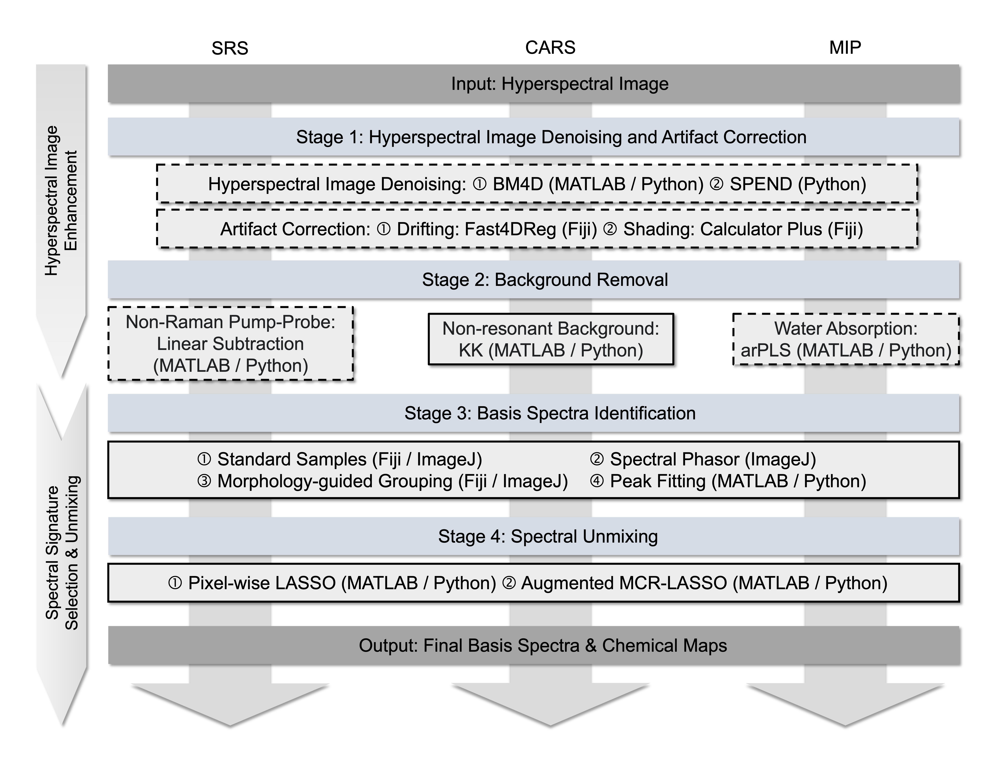

# DECIPHER
DECIPHER is a modular, scripting-based pipeline for reproducible analysis of vibrational hyperspectral imaging data, including denoising, artifact correction, background removal, spectral signature identification, and quantitative spectral unmixing. Supported modalities include stimulated Raman scattering (SRS), coherent anti-Stokes Raman scattering (CARS), and mid-infrared photothermal (MIP).

## Overview

Vibrational hyperspectral imaging provides rich chemical information from biological and material samples, but extracting quantitative and reproducible molecular maps requires careful computational processing. DECIPHER provides a standardized workflow for analyzing hyperspectral datasets across multiple vibrational imaging modalities.

  

  <b>Overview of the DECIPHER workflow for vibrational hyperspectral image analysis.</b> Three representative workflows are shown for SRS, CARS, and MIP hyperspectral image unmixing. The workflow is organized into four stages: image denoising and artifact correction, background removal, basis spectra identification, and spectral unmixing. Dashed boxes indicate optional or data-dependent steps, whereas solid boxes indicate standard workflow components

The pipeline includes tools for:

- Hyperspectral image denoising
- Artifact and drift correction
- Background removal
- Spectral signature identification
- Pixel-wise spectral unmixing
- Quantitative chemical map generation

DECIPHER is designed to support reproducible, accessible, and comparable analysis of vibrational hyperspectral imaging data.

## Supported Modalities

DECIPHER is designed for multiple vibrational imaging platforms, including:

- **SRS**: Stimulated Raman scattering microscopy
- **CARS**: Coherent anti-Stokes Raman scattering microscopy
- **MIP**: Mid-infrared photothermal microscopy

## Main Modules

### 1. Image Preprocessing

Tools for improving hyperspectral image quality, including denoising, shading correction, and drift correction.

### 2. Background Removal

Modality-specific correction methods are included for removing non-chemical or non-resonant background signals.

### 3. Spectral Signature Identification

DECIPHER supports multiple strategies for identifying chemical reference spectra, including reference-based, ROI-based, and unsupervised approaches.

### 4. Spectral Unmixing

Pixel-wise unmixing methods are provided to decompose hyperspectral images into quantitative chemical concentration maps.

## Usage

Detailed instructions for using DECIPHER are provided in the associated manuscript/protocol, including step-by-step workflows, recommended parameters, example datasets, and troubleshooting guidance.

All the data for demonstration are available at https://doi.org/10.6084/m9.figshare.31014862

## Questions and Issues

For questions, bug reports, or requests for clarification, please contact the author at linhaonan11@gmail.com
